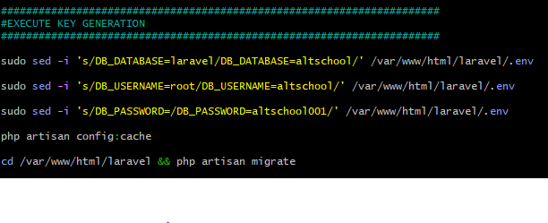
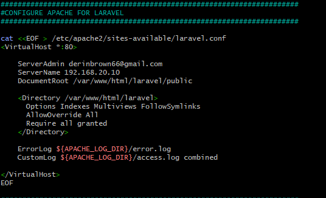

# Description
This repository contains two bashscripts for the automated provisioning of a two Ubuntu-based servers using Vagrant named 'Master' and 'Slave'. It further deploys a LAMP (Linux, Apache, MySQL, PHP) stack and a Laravel web application on the Master node, allowing for easy setup and configuration. 

It also contains an Ansible playbook that executes the bashscript on the slave node, and creates a cron jon to check the server's uptime every 12am.

# Key Features
## Vagrant Configuration:
- Utilizes Vagrant to automate the creation of the Master and Slave nodes, streamlining the deployment process.

## LAMP Stack Deployment:
- Includes a robust bash script on the Master node for setting up the LAMP stack.
- Clones a PHP -Laravel- application from GitHub.
- Installs all necessary packages.
- Configures Apache web server and MySQL.
- Ensures reusability and readability for future deployments.

## Ansible Integration:
- Employs Ansible to execute the bash script on the Slave node, ensuring consistency and reliability in the deployment process.
- Creates a cron job set to check the server's uptime every day at 12 am, ensuring constant monitoring and reporting.

# Repository
## vagrantmasterslave.sh
- generates a Vagrantfile that provisions two virtual machines named "Master" and "Slave"
- uses Ubuntu 20.04 as the base image
- sets up a private network and assigns static IPs to each server
- Master IP: 190.168.20.10
- Slave IP: 190.168.20.11
- updates and upgrades the system
- installs the avahi-daemon and libnss-mdns packages on each server
- allocates 1GB of RAM and 2 virtual CPUs for each server

## lampdeployment.sh
### Update and Install Packages
- updates package lists and upgrades the installed packages

### Install Apache
- installs Apache web server
- starts and enables the Apache service

### Install MySQL
- installs the MySQL server
- starts and enables the MySQL service

### Install PHP
- adds the PHP repository and installs PHP 8.0 along with necessary modules
- modifies PHP configuration to fix path info

### Install Composer
- installs Composer for PHP package management

### Install Laravel and Dependencies
- clones the Laravel repository from GitHub on the Master slave
- installs Laravel dependencies using Composer
- sets appropriate ownership and permissions

### Configure Apache for Laravel
- creates a virtual host configuration for Laravel
- enables mod_rewrite for URL rewriting
- restarts Apache

### Configure MySQL
- creates a new MySQL database and user for Laravel
- grants necessary privileges

### Execute Key Generation
- updates the Laravel .env file with database configuration
- generates an application key

### Install Ansible
- installs Ansible for automation

## ansibleplaybook
- files
    - directory that contains a bashscript named lampdeployment-slave.sh
    - deploys a LAMP stack and laravel web application on the slave node

- ansible.cfg
    - this is the ansible configuration file
    - specifies the path to the inventory file which in this case is set to "inventory"
    - sets the default private key file for SSH connections to "~/.ssh/id_rsa"
    - controls whether Ansible should perform host key checking for SSH connections. 

- inventory
    - defines the hosts on which Ansible should operate
    - set to the slave's IP address

- site.yaml
    - updates and upgrades the server
    - sets up a cron job scheduled to run everyday at 12am
    - uses the copy module to send the lampdeployment-slave.sh script to the slave machine and sets the ownership to root
    - uses the command module to change the script's permissions to allow execution
    - executes the lampdeployment-slave.sh script with specified arguments

# How to Run Repository
## Must Have
- Linux environment
- Vagrant
- Virtualbox
- Internet access
- Sufficient system resources

 ## Steps to use repository
 Do not skip any step. Where there is a $ symbol before a text, run the command in your Linux environment.

 Step 1: Clone this repository and cd into the directory

 `$ git clone https://github.com/SDoubleOBrown/second-semester-exam.git`
 `$ cd second-semester-exam`

 Step 2: Grant scripts permission

 `$ chmod +x vagrantmasterslave.sh`
 `$ chmod +x lampdeployment.sh`

 Step 3: Run the vagrantmasterslave script to bring up the virtual machines

 `$ ./vagrantmasterslave.sh`

 Step 4: Log into the master node. Note that this should be done in the terminal

 `$ vagrant ssh master`

 Step 5: Log in as root user to ensure commands which require elevated privileges can be run

 `$ sudo su`

 Step 6: cd into Vagrant folder to access scripts and edit the lampdeployment script using any editor of your choice

 `$ cd /Vagrant`
 `$ nano lampdeployment.sh`

 Step 7: Change USERNAME, DATABASE and PASSWORD of the .env to any of your choosing. USERNAME and DATABASE should be the same values

 
  
  Change serveradmin email address and server to your email address and server or domain name of master node

 

 Step 8: Run lampdeployment script with SQL name and password set as arguments respectively

 `$ ./lampdeployment.sh myname mypassword`

 To confirm success, input your IP address in your web address.

 Step 9: Set up Master node to seamlessly SSH into slave node without requiring password

 Step 10: Ensure you are in the vagrant directory and cd into the ansibleplaybook directory. Run the ansible file 

 `$ cd ~/vagrant/ansibleplaybook`
 `$ ansible-playbook -i inventory site.yaml`

 Step 11: Confirm success. This can be done by inputting the IP address of the slave machine in your local browser. You can also confirm the presence of the laravel directory.